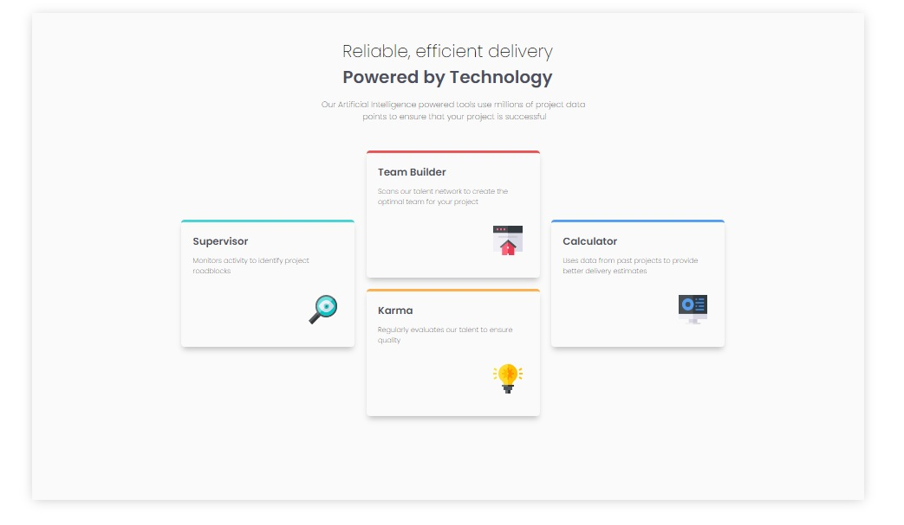

# Frontend Mentor - Four card feature section solution

Esta é a minha solução para o [Four card feature section challenge on Frontend Mentor](https://www.frontendmentor.io/challenges/four-card-feature-section-weK1eFYK). 

- ## Visão geral

  ### O desafio

  Os usuários devem ser capazes de:

  - Visualizar o layout ideal para o site, dependendo do tamanho da tela do dispositivo.

### Screenshot

### Links

- Live Site URL: [Add live site URL here](https://your-live-site-url.com)

## Meu processo

### Construído com

- HTML5

- CSS 

- Flexbox

- CSS Grid

  

### O que eu aprendi

1. Me incentivou a começar usar mais as tags HTML 5, section, headder.
2. Me ajudou a aprender como usar o display grid.
3. Utilizar a tag pre para textos pre definidos e depois estilizar ela do jeito que preferir com CSS.

#### Conclusao

Gostei de ter feito esse desafio, talvez a minha não seja a melhor solução mas consegui aprender bastante e pretendo continuar estudando para me aprimorar mais no css.

